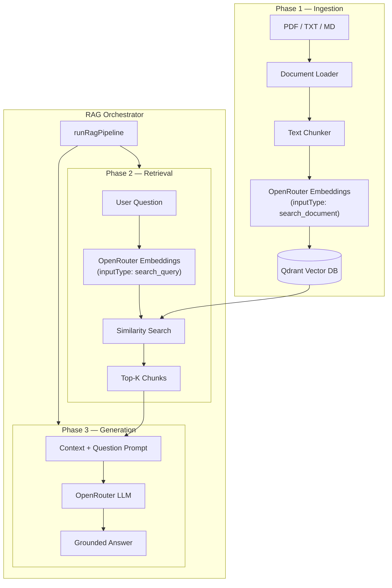
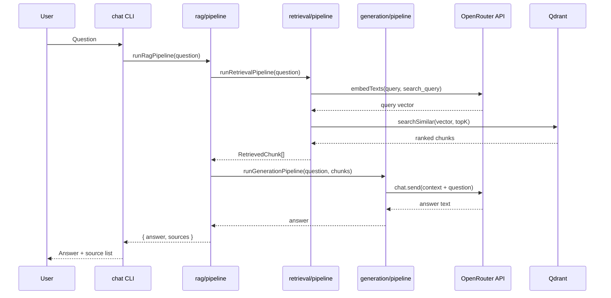

# PDF Ingestion Pipeline — RAG Chatbot

A **Retrieval-Augmented Generation (RAG)** chatbot built in TypeScript. Documents are ingested into **Qdrant**, user questions retrieve relevant chunks via vector search, and an **OpenRouter** LLM generates grounded answers.

The system uses a **single embedding model** for both storing document vectors and embedding user queries, so vectors live in the same semantic space.

---

## What it does

| Phase | Purpose |
|-------|---------|
| **1. Ingestion** | Load PDF/TXT/MD → split into chunks → embed via OpenRouter → store in Qdrant |
| **2. Retrieval** | Embed the user question → cosine similarity search → return top-K chunks |
| **3. Generation** | Pass retrieved context + question to an OpenRouter LLM → return an answer with source citations |

Supported document formats: **`.pdf`**, **`.txt`**, **`.md`**, **`.markdown`**.

---

## Architecture



### End-to-end chat flow



---

## Requirements

### Software

| Requirement | Version / notes |
|-------------|-----------------|
| **Node.js** | `>= 20.16` recommended (PDF parsing via `pdf-parse` v2). `20.12+` may work with warnings. |
| **npm** | Comes with Node.js |
| **Docker** | Optional, for running Qdrant locally via `docker compose` |

### Services & API keys

| Service | Purpose |
|---------|---------|
| **[OpenRouter](https://openrouter.ai/)** | Embeddings + LLM (`OPENROUTER_API_KEY` required) |
| **[Qdrant](https://qdrant.tech/)** | Vector database (default: `http://localhost:6333`) |

---

## Quick start

### 1. Clone and install

```bash
cd PDF-Ingestion-pipeline
npm install
```

### 2. Configure environment

```bash
cp .env.example .env
```

Edit `.env` and set at minimum:

```env
OPENROUTER_API_KEY=your_openrouter_api_key
```

See [Configuration](#configuration) for all options.

### 3. Start Qdrant

```bash
npm run start:qdrant
```

This runs `docker compose up -d` (Qdrant on ports `6333` / `6334`).

Verify Qdrant is up:

```bash
curl http://localhost:6333/collections
```

### 4. Ingest documents

```bash
npm run ingest -- path/to/document.pdf
npm run ingest -- data/sample.txt
```

Example:

```bash
npm run ingest -- /home/you/Downloads/iso27001.pdf
```

### 5. Chat

**One-shot question:**

```bash
npm run chat -- "What are the responsibilities of this organization?"
```

**Interactive REPL** (type `exit` to quit):

```bash
npm run chat
```

> **Note:** Use `npm run chat`, not `run chat`. The `npm` prefix runs scripts defined in `package.json`.

---

## Commands

| Command | Description |
|---------|-------------|
| `npm install` | Install dependencies |
| `npm run build` | Compile TypeScript to `dist/` |
| `npm run start:qdrant` | Start Qdrant via Docker Compose |
| `npm run ingest -- <file>` | Run ingestion pipeline on a file |
| `npm run chat` | Start interactive Q&A session |
| `npm run chat -- "<question>"` | Ask a single question and exit |

---

## Configuration

All settings are loaded from `.env` (see `.env.example`).

| Variable | Default | Description |
|----------|---------|-------------|
| `OPENROUTER_API_KEY` | *(required)* | OpenRouter API key |
| `EMBEDDING_MODEL` | `openai/text-embedding-3-small` | Model for document and query embeddings |
| `LLM_MODEL` | `google/gemini-2.0-flash-001` | Model for answer generation |
| `QDRANT_URL` | `http://localhost:6333` | Qdrant REST API URL |
| `QDRANT_COLLECTION` | `documents` | Collection name |
| `EMBEDDING_DIMENSIONS` | `1536` | Vector size (must match embedding model) |
| `CHUNK_SIZE` | `800` | Max characters per chunk |
| `CHUNK_OVERLAP` | `150` | Overlap between consecutive chunks |
| `TOP_K` | `5` | Number of chunks retrieved per question |

Browse models: [openrouter.ai/models](https://openrouter.ai/models)

If you change the embedding model, update `EMBEDDING_DIMENSIONS` to match that model’s output size.

---

## Project structure

```
PDF-Ingestion-pipeline/
├── src/
│   ├── config.ts                 # Environment configuration
│   ├── types.ts                  # Shared TypeScript types
│   ├── services/
│   │   ├── openrouter.ts         # Embeddings + LLM client
│   │   └── qdrant.ts             # Vector DB operations
│   ├── ingestion/
│   │   ├── loader.ts             # PDF / text file loading
│   │   ├── chunker.ts            # Text splitting
│   │   └── pipeline.ts           # Phase 1 orchestration
│   ├── retrieval/
│   │   └── pipeline.ts           # Phase 2 orchestration
│   ├── generation/
│   │   └── pipeline.ts           # Phase 3 orchestration
│   ├── rag/
│   │   └── pipeline.ts           # Full RAG (retrieval + generation)
│   ├── cli/
│   │   ├── ingest.ts             # Ingestion CLI
│   │   └── chat.ts               # Chat CLI
│   └── index.ts                  # Programmatic exports
├── data/
│   └── sample.txt                # Sample document for testing
├── docker-compose.yml            # Qdrant service
├── .env.example                  # Environment template
└── package.json
```

---

## How each phase works

### Phase 1 — Ingestion (`src/ingestion/pipeline.ts`)

1. **Load** — `loader.ts` extracts text from PDF (per-page) or plain text files.
2. **Chunk** — `chunker.ts` splits text into overlapping segments (`CHUNK_SIZE` / `CHUNK_OVERLAP`), preferring breaks at paragraphs or sentences.
3. **Embed** — Chunks are sent to OpenRouter with `inputType: search_document` (same `EMBEDDING_MODEL` as queries).
4. **Store** — Vectors and metadata (`text`, `source`, `page`, `chunkIndex`) are upserted into Qdrant.

### Phase 2 — Retrieval (`src/retrieval/pipeline.ts`)

1. Embed the user question with `inputType: search_query`.
2. Run cosine similarity search in Qdrant.
3. Return the top `TOP_K` chunks with similarity scores.

### Phase 3 — Generation (`src/generation/pipeline.ts`)

1. Format retrieved chunks into a context block with source labels.
2. Send a system prompt (answer only from context) + user prompt (context + question) to the OpenRouter LLM.
3. Return the generated answer.

### RAG orchestrator (`src/rag/pipeline.ts`)

`runRagPipeline(question)` runs retrieval, then generation, and returns `{ answer, sources }`.

---

## Programmatic usage

```typescript
import {
  runIngestionPipeline,
  runRagPipeline,
} from "./dist/index.js";

await runIngestionPipeline("./docs/manual.pdf");

const { answer, sources } = await runRagPipeline(
  "What is the scope of the ISMS?",
);

console.log(answer);
console.log(sources);
```

Build first: `npm run build`

---

## Troubleshooting

### `DOMMatrix is not defined` when ingesting PDFs

`pdf-parse` v2 needs Node.js browser API polyfills. The loader imports `pdf-parse/worker` before `pdf-parse` and passes `CanvasFactory`. If you still see this error, upgrade Node.js to **>= 20.16**.

### `Command 'run' not found`

Use `npm run chat`, not `run chat`.

### `Missing required environment variable: OPENROUTER_API_KEY`

Create `.env` from `.env.example` and set your OpenRouter API key.

### Qdrant connection errors

- Start Qdrant: `npm run start:qdrant`
- Confirm Docker is running
- Check `QDRANT_URL` in `.env`

### Empty or weak answers

- Ingest the relevant documents first (`npm run ingest -- <file>`)
- Increase `TOP_K` in `.env` for more context
- Try a different `LLM_MODEL` on OpenRouter

### Embedding dimension mismatch

Set `EMBEDDING_DIMENSIONS` to match your chosen `EMBEDDING_MODEL` (e.g. `1536` for `text-embedding-3-small`).

---

## Tech stack

- **TypeScript** — Application language
- **OpenRouter** — Embeddings + LLM (`@openrouter/sdk`)
- **Qdrant** — Vector database (`@qdrant/js-client-rest`)
- **pdf-parse** — PDF text extraction
- **Docker Compose** — Local Qdrant deployment

---

## License

ISC
